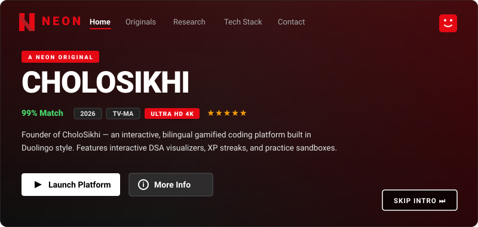
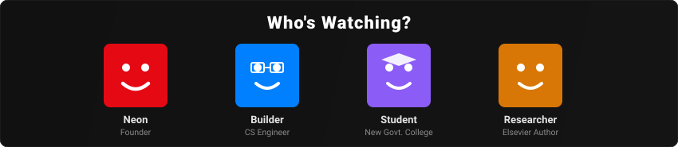
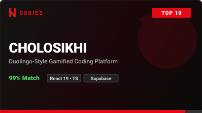
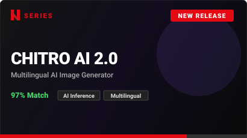
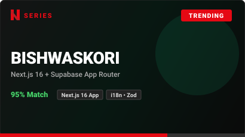
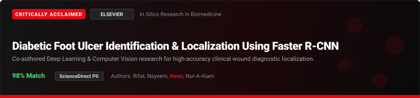
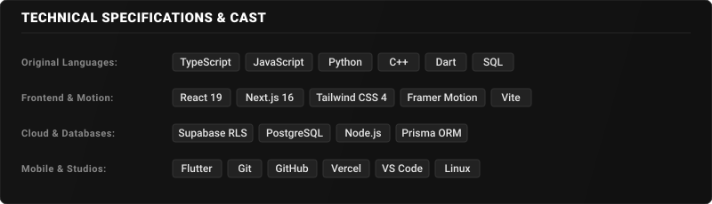
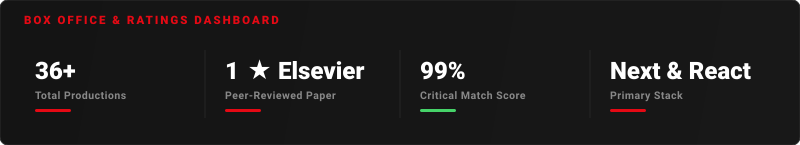

  

---

## 🔴 Trending Now | Original Series

<table>
  <tr>
    <td width="33%" valign="top">
      
      

        
        
      

      

        <strong>Duolingo-style bilingual coding ecosystem</strong> featuring live DSA visualizers, XP streaks, quizzes, and bite-sized Bangla lessons.
      

    </td>
    <td width="33%" valign="top">
      
      

        
      

      

        <strong>Multilingual AI Image Generator</strong> enabling cross-language prompt transformations and automated creative image generation.
      

    </td>
    <td width="33%" valign="top">
      
      

        
      

      

        <strong>Modern full-stack web application</strong> built with Next.js 16 App Router, Supabase backend, type-safe validation, and internationalization.
      

    </td>
  </tr>
</table>

---

## 🏆 Critically Acclaimed | Peer-Reviewed Research

  

  
  &nbsp;
  
  &nbsp;
  

---

## ⚡ Cast & Production Equipment (Tech Stack)

---

## 📊 Box Office & Viewer Ratings

  

<strong>🐍 Daily Streaming Schedule (Commit Activity):</strong>

---

## 🎟️ Start Your Membership | Connect With Neon

<strong>Unlimited code, architectural discussions, and startup collaborations.</strong>

  
  &nbsp;
  
  &nbsp;
  
  &nbsp;
  

 

*"First, solve the problem. Then, write the code."* — John Johnson

🍿 **Directed & Produced by [Md. Neamul Morshed Neon](https://github.com/Neamul09)**

